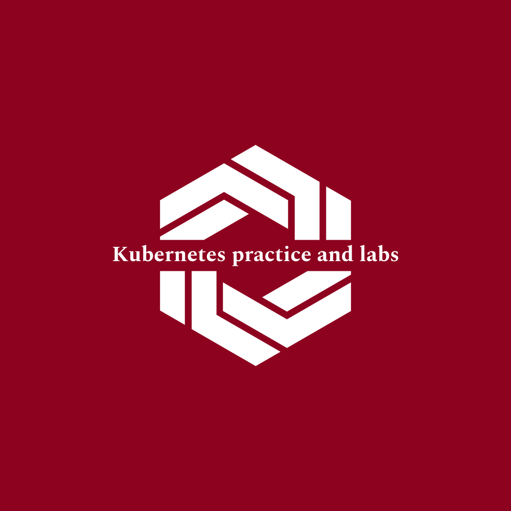

<h1 style="text-align: center;">Kubernetes practice and labs</h1>
<h2 style="text-align: center;">Certified Kubernetes Administrator</h2>

  
   
  <i>This repository provides various tasks, labs and practice activities done by me to prepare for Certified Kubernetes Administrator.
     Practice problems are taken from courses by Kode Kloud and LFS258(The Linux Foundation)</i>
   

## Repository Path

[Practice Source Repository](https://github.com/bhushanpadhye/k8s-certification-practice.git)

## Get Started

- [Lab Provisioning](./lab-provisioning/README.md)
- [Labs 101 - Basic Commands](./labs-101-basic-commands/INDEX.md)
- [Labs 102 - Pod](./labs-102-pod/INDEX.md)
- [Labs 103 - ReplicaSet](./labs-103-replica-set/INDEX.md)
- [Labs 104 - Deployment](./labs-104-deployment/INDEX.md)
- [Labs 105 - Network Basic](./labs-105-network-basic/INDEX.md)
- [Labs 106 - Sample Voting App](./labs-106-sample-voting-app/README.md)