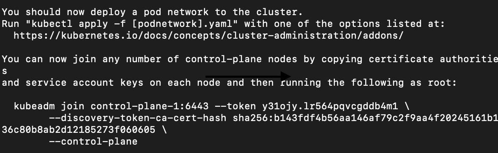

# Kubernetes Cluster Installation using Kubeadm

kubeadm, the community-suggested tool from the Kubernetes project, that makes installing Kubernetes easy and avoids vendor-specific installers. Getting a cluster running involves two commands: kubeadm init, that you run on a cp node, and then, kubeadm join, that you run on your worker or redundant cp nodes, and your cluster bootstraps itself. The flexibility of these tools allows Kubernetes to be deployed in a number of places.

To join other nodes to the cluster, you will need at least one token and an SHA256 hash. This information is returned by the command kubeadm init. Once the cp has initialized, you would apply a network plugin. Main steps:

- Run kubeadm init on the control plane node.
- Create a network for IP-per-Pod criteria.
- Run kubeadm join on workers or secondary cp nodes.

### Step By Step Guide

1. login as root user:
 <pre><code>sudo -i</code></pre>

2. Run kubeadmin init command:
 <pre><code>kubeadm init --pod-network-cidr=20.96.0.0/16 --apiserver-advertise-address=192.168.56.2 --control-plane-endpoint=192.168.56.2</code></pre>

3. From above command output note down kubeadm join command and run it on all worker nodes as root user(sudo -i) after step 10.: 
 

4. To start using your cluster, you need to run the following as a regular user and copy ~/.kube/config as admin kube config file to your host:
<pre><code>mkdir -p $HOME/.kube
sudo cp -i /etc/kubernetes/admin.conf $HOME/.kube/config
sudo chown $(id -u):$(id -g) $HOME/.kube/config</code></pre>

5. Verify nodes by running command on control-plane as regular user and note that core-dns pods are pending.
<pre><code>kubectl get nodes
kubectl get pods -A</code></pre>

6. Deploying pod network addon - Calico
<pre><code>kubectl apply -f https://raw.githubusercontent.com/projectcalico/calico/v3.25.0/manifests/calico.yaml</code></pre>

7. The Dashboard UI is not deployed by default. To deploy it, run the following command:
<pre><code>kubectl apply -f https://raw.githubusercontent.com/kubernetes/dashboard/v2.7.0/aio/deploy/recommended.yaml</code></pre>

8. Run kubectl proxy on host machine to access dashboard
<pre><code>kubectl proxy</code></pre>

Dashboard is available at [Dashboard Url](http://localhost:8001/api/v1/namespaces/kubernetes-dashboard/services/https:kubernetes-dashboard:/proxy/)

9. [Create sample user following link](https://github.com/kubernetes/dashboard/blob/master/docs/user/access-control/creating-sample-user.md)

