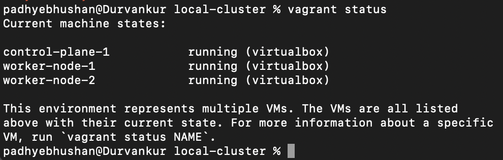
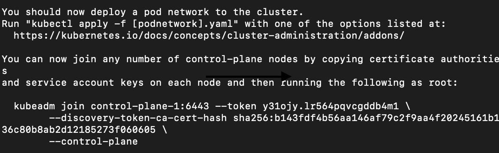

# Local Cluster Setup 

### Pre-Requisites

- Oracle Virtual Box
- Vagrant
- kubectl

### Preparing lab environment

1. Go to folder [repo]/lab-provisioning/local-cluster

2. Run command:
 <pre><code>vagrant up</code></pre>
 
3. Once finished check status using command:
 <pre><code>vagrant status</code></pre>

 

4. SSH into control plane using command:
 <pre><code>vagrant ssh control-plane-1</code></pre>

5. login as root user:
 <pre><code>sudo -i</code></pre>

6. Run kubeadmin init command:
 <pre><code>kubeadm init --pod-network-cidr=192.168.0.0/16 --cri-socket=unix:///var/run/cri-dockerd.sock --apiserver-advertise-address=192.168.56.2 --control-plane-endpoint=192.168.56.2</code></pre>

7. From above command output note down kubeadm join command and run it on all worker nodes as root user(sudo -i) after step 10.: 
 

8. To start using your cluster, you need to run the following as a regular user and copy ~/.kube/config as admin kube config file to your host:
<pre><code>mkdir -p $HOME/.kube
sudo cp -i /etc/kubernetes/admin.conf $HOME/.kube/config
sudo chown $(id -u):$(id -g) $HOME/.kube/config</code></pre>

9. Verify nodes by running command on control-plane as regular user and note that core-dns pods are pending.
<pre><code>kubectl get pods -A</code></pre>

10. Deploying pod network addon - Calico
<pre><code>kubectl apply -f https://raw.githubusercontent.com/projectcalico/calico/v3.17.0/manifests/calico.yaml</code></pre>

11. The Dashboard UI is not deployed by default. To deploy it, run the following command:
<pre><code>kubectl apply -f https://raw.githubusercontent.com/kubernetes/dashboard/v2.7.0/aio/deploy/recommended.yaml</code></pre>

12. Run kubectl proxy on host machine to access dashboard
<pre><code>kubectl proxy</code></pre>

Dashboard is available at [Dashboard Url](http://localhost:8001/api/v1/namespaces/kubernetes-dashboard/services/https:kubernetes-dashboard:/proxy/)

13. [Create sample user following link](https://github.com/kubernetes/dashboard/blob/master/docs/user/access-control/creating-sample-user.md)

P.S. To merge kube config file on unix based systems
<pre><code>cp ~/.kube/config ~/.kube/config.bak && KUBECONFIG=~/.kube/config:/tmp/new-config kubectl config view --flatten > /tmp/config && mv /tmp/config ~/.kube/config</code></pre>