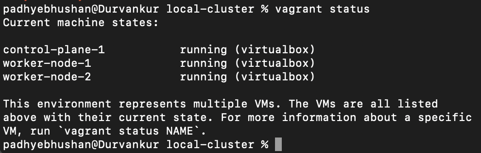

# Provisioning Lab Environment

## Local Cluster Setup 

### Pre-Requisites

- Oracle Virtual Box
- Vagrant
- kubectl

### Preparing lab environment

1. Go to folder [repo]/lab-provisioning/local-cluster

2. Run command:
 <pre><code>vagrant up</code></pre>
 
3. Once finished check status using command:
 <pre><code>vagrant status</code></pre>

 

4. SSH into control plane using command:
 <pre><code>vagrant ssh control-plane-1</code></pre>

5. login as root user:
 <pre><code>sudo -i</code></pre>

6. Validate cri-dockerd url
 <pre><code>sudo systemctl status cri-dockerd.socket | grep "Listen" | awk '{print $2}'</code></pre>

6. Run kubeadmin init command:
 <pre><code>kubeadm init --apiserver-advertise-address=192.168.56.2 --control-plane-endpoint=control-plane-1 --cri-socket=unix:///run/cri-dockerd.sock</code></pre>

