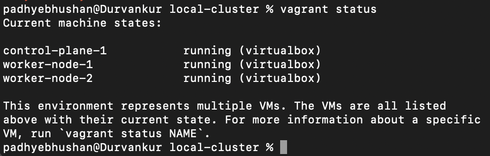

# Local Cluster Setup 

### Pre-Requisites

- Oracle Virtual Box
- Vagrant
- kubectl

### Preparing lab environment

1. Go to folder [repo]/lab-provisioning/local-cluster

2. Run command:
 <pre><code>vagrant up</code></pre>
 
3. Once finished check status using command:
 <pre><code>vagrant status</code></pre>

 

4. SSH into provisioned machine using machine name. Example to ssh into control-plane-1 use command:
 <pre><code>vagrant ssh control-plane-1</code></pre>