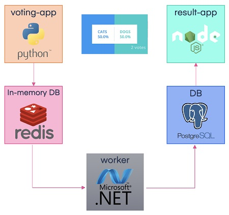

# [LAB-106] Docker's sample voting app

### Task Definition

A simple distributed (Micro-Service based) application running across multiple Docker containers.
This solution uses Python, Node.js, .NET, with Redis for messaging and Postgres for storage.
- A front-end web app in Python which lets you vote between two options
- A Redis which collects new votes
- A .NET worker which consumes votes and stores them in…
- A Postgres database backed by a Docker volume
- A Node.js web app which shows the results of the voting in real time

Note:
- Frontend services i.e. voting and result app needs to be accessible outside cluster as web application. Use NodePort type service for self-managed cluster and LoadBalancer type service for managed cluster like GKE. 
- For postgres we need "postgres" database password and database username as environment variable
- postgres runs on port <em>5432</em> and redis works on port <em>6379</em>
- Voting and Worker app needs connection to redis service to startup
- Result and Worker app needs connection to postgres service to startup
- Images Used:
  - voting app: dockersamples/examplevotingapp_vote
  - worker app: dockersamples/examplevotingapp_worker
  - result app: dockersamples/examplevotingapp_result
  - redis: redis
  - postgres: postgres

For more details, refer [Docker Example](https://github.com/dockersamples/example-voting-app)

## Docker Voting Application Microservice Architecture

